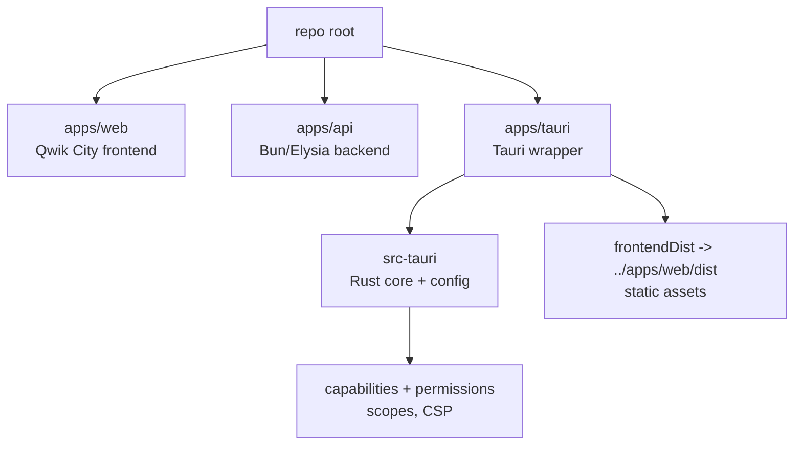
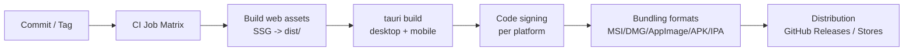

# Native-first Desktop and Mobile App Packaging for prometheus-site Using Tauri

## Executive summary

This research outlines a practical, production-oriented way to turn your existing website into “native-feeling” desktop apps and Android/iOS apps using Tauri, while preserving a single web UI codebase and adding native integrations where they actually matter (menus, dialogs, notifications, deep links, OS conventions, etc.). Tauri 2.x is explicitly positioned for both desktop and mobile targets (iOS/Android) and supports using Rust plus platform-native Swift/Kotlin where needed. citeturn29view0turn29view2

Two realities drive the overall approach:

First, Tauri’s webview runtime model means your frontend must be a static build (SSG / pre-rendered assets) rather than a server-rendered web app in production. The Tauri documentation is explicit: “Tauri does not support server-based solutions” and expects a folder of built assets (like `dist/`). citeturn19view0

Second, mobile support is real in Tauri 2.0, but the maintainers note the mobile developer experience is still being improved and that not all official plugins are supported on mobile yet. citeturn29view3turn27search10  
This means your best strategy is usually:

- Use Tauri for desktop immediately (high ROI, mature UX surface area).
- For mobile, either adopt Tauri mobile and accept plugin gaps, or keep/extend your existing mobile wrapper approach until your required native features are covered. (Your repo already suggests mobile packaging work is part of the project’s goals.) citeturn9view0

Finally, store policies matter: App Store review rules restrict apps from downloading/executing code that changes functionality, which intersects directly with “self-updating” behavior. citeturn33search4 On Android, Google explicitly warns that many forms of dynamic code loading—especially from remote sources—violate Google Play policies. citeturn33search2  
So: use Tauri’s updater for desktop, and use store-based updates on mobile.

## Current repository assessment and constraints

Your repository is structured as a multi-app project, with a web frontend and an API backend called out directly in the repo overview. The README describes:

- `apps/web` as the frontend, built with Qwik City and TanStack Query for caching.
- `apps/api` as the backend, built with Elysia (Bun).
- Local development ports: the web app on `http://localhost:4173/` and the API on `http://localhost:4000/`. citeturn9view0

This has three important consequences for Tauri integration:

- **Static build requirement:** Qwik City often supports SSR patterns, but for Tauri production you want an SSG/static output path that emits a `dist/` directory and avoids requiring a running HTTP server. Tauri is explicit about not supporting server-based frontends in production. citeturn19view0
- **API coupling:** You should decide whether the desktop/mobile wrappers talk to a remote API (typical) or whether you embed/ship a local API service with the app (possible, but increases complexity and signing/attack surface).
- **Routing/deep-linking:** A web SPA or hybrid route system must handle “app deep links” and offline loads cleanly. This is where Tauri deep-link handling and client-side route fallback work together.

## Target architecture and project layout

The “native-first” end state is best achieved by introducing a dedicated application wrapper layer that:

- builds and bundles static web assets into the app,
- adds OS integrations (menu / tray / shortcuts / notifications / file dialogs / deep links),
- applies a strict security posture (capabilities, command scopes, CSP),
- packages and signs per platform.

A monorepo-friendly layout is to add a new `apps/tauri` (or `apps/desktop`) app without disrupting your existing `apps/web` and `apps/api`.



Build and release becomes a pipeline that (a) produces a static web build, (b) runs `tauri build` for each target, (c) signs artifacts, and (d) uploads to the right distribution channel (GitHub releases, Microsoft Store, App Store, Google Play, etc.). Tauri’s own GitHub pipeline guide describes a standard approach using `tauri-action` to build artifacts and publish releases, and notes you can wire the updater to query those releases. citeturn37view0



## Step-by-step implementation plan

This plan is structured to get you to production desktop builds first, then mobile, while minimizing rework and maximizing “native feel” per platform.

### Install prerequisites and toolchains

Desktop prerequisites:

- Linux builds require WebKitGTK and other system dependencies; Tauri’s prerequisites page lists concrete package names (e.g., `libwebkit2gtk-4.1-dev` on Debian/Ubuntu) and notes distro variance. citeturn28view0
- Windows development requires Microsoft C++ build tools and Microsoft Edge WebView2. citeturn28view0
- macOS development uses Xcode; Tauri notes Xcode is required, and if you only build desktop you can use Xcode Command Line Tools. citeturn28view0

Mobile prerequisites (only if you target Android/iOS with Tauri 2.x):

- Android: Android Studio, SDK components (platform-tools, NDK, build-tools, command-line tools), environment variables like `JAVA_HOME`, `ANDROID_HOME`, `NDK_HOME`, and multiple Rust Android targets. citeturn27search1turn28view0
- iOS: requires macOS + Xcode, Rust iOS targets, plus CocoaPods. citeturn27search1turn28view0
- Tauri’s mobile dev tooling supports device selection and opening Xcode/Android Studio from the CLI. citeturn27search10turn28view2

### Add a Tauri wrapper app in the monorepo

A typical approach is:

1. Create `apps/tauri` (or `apps/desktop`) and initialize a Tauri 2.x project.
2. Configure Tauri to:
   - run your frontend dev server during development, and
   - bundle your frontend static assets during production builds.

Tauri’s Qwik integration guidance shows the exact pattern: `beforeDevCommand`, `beforeBuildCommand`, `devUrl`, and `frontendDist`. citeturn19view0

Example `apps/tauri/src-tauri/tauri.conf.json` (representative; adapt paths to your actual frontend folder name):

```json
{
  "$schema": "https://schema.tauri.app/config/2",
  "productName": "Prometheus",
  "version": "0.1.0",
  "identifier": "com.prometheus.app",
  "build": {
    "beforeDevCommand": "bun --cwd ../web dev --port 4173",
    "devUrl": "http://localhost:4173",
    "beforeBuildCommand": "bun --cwd ../web build",
    "frontendDist": "../web/dist"
  },
  "app": {
    "withGlobalTauri": false,
    "security": {
      "csp": "default-src 'self'; img-src 'self' asset: data:; style-src 'self' 'unsafe-inline'; connect-src https://api.yourdomain.com"
    }
  },
  "bundle": {
    "active": true,
    "targets": ["msi", "nsis", "dmg", "appimage", "deb", "rpm"],
    "icon": ["icons/icon.png", "icons/icon.icns", "icons/icon.ico"]
  },
  "plugins": {
    "updater": {
      "active": true,
      "endpoints": ["https://updates.yourdomain.com/prometheus/latest.json"],
      "pubkey": "REPLACE_WITH_TAURI_PUBLIC_KEY"
    }
  }
}
```

Why `frontendDist` must be static: Tauri explicitly requires a “folder” of built assets (`dist`-like) and does not support server-based solutions in production. citeturn19view0

### Establish permissions, capabilities, and command scopes early

Tauri 2.x moved toward a more explicit permission model. The configuration docs describe capabilities and that you can define platform-specific configuration and merge patches across multiple config files. citeturn21view1turn21view0

Core principles to implement:

- **Capabilities as the gate:** potentially dangerous plugin commands/scopes are blocked by default and must be enabled via your `capabilities` configuration. citeturn32view2
- **Command scopes:** allow/deny scopes are a granular mechanism; deny always supersedes allow, and the command/plugin must enforce scope validation without bypasses. citeturn40view0
- **File system access:** the file-system plugin supports allow/deny path scopes and deny takes precedence. citeturn39view0

Representative `apps/tauri/src-tauri/capabilities/default.json`:

```json
{
  "identifier": "main",
  "windows": ["main"],
  "permissions": [
    "core:default",
    "dialog:default",
    "notification:default",
    "updater:default",

    "fs:allow-appdata-read",
    "fs:allow-appdata-write"
  ]
}
```

Scoped file access should be implemented narrowly. Tauri’s scope examples call out that webview data can contain sensitive information and show deny scopes for webview data directories. citeturn40view0

### Wire web↔native IPC and native plugins

Use `invoke` for calling Rust commands from the UI and keep the surface small. Tauri’s JS API migration notes that `@tauri-apps/api/tauri` became `@tauri-apps/api/core`, and shows the `invoke` import pattern. citeturn38search2turn38search8

Frontend example:

```ts
import { invoke } from "@tauri-apps/api/core";

export async function getAppVersion(): Promise<string> {
  return invoke("get_app_version");
}
```

Rust command example (`apps/tauri/src-tauri/src/lib.rs`):

```rust
#[tauri::command]
fn get_app_version() -> String {
  env!("CARGO_PKG_VERSION").to_string()
}

#[cfg_attr(mobile, tauri::mobile_entry_point)]
pub fn run() {
  tauri::Builder::default()
    .invoke_handler(tauri::generate_handler![get_app_version])
    .run(tauri::generate_context!())
    .expect("error while running tauri application");
}
```

Add plugins via the Tauri CLI where possible. For example, the notifications plugin setup includes `bun tauri add notification` and requires enabling the Rust plugin in `lib.rs`. citeturn31view0

### Configure desktop packaging, signing, and distribution

Desktop distribution options are well-covered by Tauri’s “Distribute” docs.

- **GitHub releases + updater:** Tauri’s pipeline guide shows how to use `tauri-action` in GitHub Actions to build/upload artifacts and wire the updater to query the GitHub release. citeturn37view0turn32view1
- **Updater signing:** The updater requires signatures and “cannot be disabled”; you configure a public key in `tauri.conf.json`. citeturn32view2

For Windows/macOS/Linux signing, consult Tauri’s per-platform signing docs. citeturn12search0turn0search5turn0search6

You should model desktop update artifacts after Tauri’s guidance: the updater produces `.sig` signature files for the shipped bundles (e.g., `.AppImage.sig`, `.tar.gz.sig`, `.msi.sig`), and the update JSON must contain the signature content (not a URL to a signature file). citeturn32view1

### Configure Android and iOS packaging, signing, and store distribution

Tauri’s distribution docs now include direct sections for Google Play and App Store.

- Android app releases to Google Play are explicitly addressed as a distribution target. citeturn25view0turn17view0
- iOS distribution is described under “App Store,” including common compliance steps such as export compliance/encryption declarations. citeturn25view1

Signing requirements:

- Android signing guidance is covered by the Tauri Android signing page, including generating or using a keystore and configuring signing. citeturn18view0turn18view1
- iOS signing requires being in the Apple Developer Program and using Xcode tooling. citeturn18view2

Policy implications for updates:

- iOS App Store review rules restrict downloading/installing/executing code that changes features/functionality of the app (with narrow exceptions), which strongly constrains “self-updating” techniques outside the store. citeturn33search4
- Android’s security guidance warns that many forms of remote dynamic code loading violate Google Play policies. citeturn33search2

Therefore: mobile should rely on store update mechanisms for production deployments, and your “updater” story should focus on desktop first even though the updater plugin lists supported platforms including Android/iOS. citeturn32view0turn33search4turn33search2

### CI/CD with GitHub Actions

Tauri provides a concrete GitHub Actions workflow example using `tauri-action`, including a matrix that builds Windows, macOS (Intel + Apple Silicon targets), and Linux, and installs Linux dependencies like WebKitGTK on Ubuntu. citeturn37view0turn28view0

A Bun-adapted workflow (representative; add signing secrets per platform):

```yaml
name: publish

on:
  push:
    tags:
      - "app-v*"
  workflow_dispatch:

jobs:
  build:
    permissions:
      contents: write
    strategy:
      fail-fast: false
      matrix:
        include:
          - os: windows-latest
            args: ""
          - os: macos-latest
            args: "--target aarch64-apple-darwin"
          - os: macos-latest
            args: "--target x86_64-apple-darwin"
          - os: ubuntu-22.04
            args: ""

    runs-on: ${{ matrix.os }}

    steps:
      - uses: actions/checkout@v4

      - name: Linux system deps
        if: matrix.os == 'ubuntu-22.04'
        run: |
          sudo apt-get update
          sudo apt-get install -y libwebkit2gtk-4.1-dev libappindicator3-dev librsvg2-dev patchelf

      - name: Setup Bun
        uses: oven-sh/setup-bun@v2
        with:
          bun-version: "latest"

      - name: Install JS deps
        run: bun install

      - name: Build web assets
        run: bun --cwd apps/web build

      - name: Install Rust stable
        uses: dtolnay/rust-toolchain@stable

      - name: Rust cache
        uses: swatinem/rust-cache@v2
        with:
          workspaces: "./apps/tauri/src-tauri -> target"

      - name: Build and release
        uses: tauri-apps/tauri-action@v0
        env:
          GITHUB_TOKEN: ${{ secrets.GITHUB_TOKEN }}
        with:
          projectPath: "apps/tauri"
          args: ${{ matrix.args }}
          tagName: app-v__VERSION__
          releaseName: "Prometheus v__VERSION__"
```

The overall structure matches Tauri’s official guidance (tauri-action + GitHub Actions), but uses Bun for dependency installation and web builds. citeturn37view0

## Native-first UI and system integrations

“Native-first feel” is mostly achieved by respecting platform conventions, not by copying platform visuals. The goal is to behave like a real app: menus on desktop, correct navigation on mobile, solid keyboard shortcuts, system dialogs, and appropriate permissions prompts.

image_group{"layout":"carousel","aspect_ratio":"16:9","query":["Tauri desktop app window menu example","Tauri system tray example","Android Material navigation rail adaptive layout example","iOS safe area insets example"],"num_per_query":1}

Desktop patterns using Tauri APIs:

- **Menu bar (desktop):** Tauri’s Window Menu guide shows native menus attached to a window and notes this is “Available on desktop.” citeturn30view0  
  You should implement OS-standard items (Preferences, About, Quit) and map shortcuts consistently (e.g., Ctrl+Q quit on Linux desktops). GNOME’s shortcut conventions provide concrete mappings. citeturn34search2  
  On Windows, Microsoft emphasizes consistent keyboard shortcuts and avoiding overriding system-wide shortcuts. citeturn34search1  
  Apple’s menu guidance stresses clear verb labels and familiar behavior for menus. citeturn35search0

- **System tray:** Tauri provides a dedicated “System Tray” learning page (desktop integration surface for background behaviors, quick actions). citeturn30view1

- **Splash screen:** A properly configured splash reduces perceived startup cost and is directly supported via Tauri’s splashscreen guidance. citeturn30view3

- **Notifications:** Tauri’s notification plugin is cross-platform; it includes a note that Windows notifications only work for installed apps and show a PowerShell name/icon during development. citeturn31view0  
  If notifications are part of your “native feel,” validate them only in installed builds on Windows.

- **File dialogs:** Use the dialog plugin for open/save pickers rather than building web file pickers (more native, better security posture). citeturn31view1

- **Local file access:** Use the file-system plugin with carefully scoped permissions. The plugin supports allow/deny path scopes and deny overrides allow. citeturn39view0turn40view0  
  Avoid granting broad access like `$HOME/**` unless your product truly needs it.

Mobile-first UI expectations:

- **Adaptive navigation:** Material guidance strongly differentiates bottom navigation on phones vs navigation rail on larger screens; this matters when your “website UI” is reused on tablets and foldables. citeturn33search5turn33search0
- **Safe areas:** on iOS, safe areas exist specifically because system bars can occlude content; Apple’s UIKit documentation explains that even translucent bars occlude content underneath and you should lay out within `safeAreaLayoutGuide`. citeturn36search3
- **Command surfaces:** Windows design guidance for command bars highlights different placement for small handheld devices vs larger screens (reachability vs discoverability). citeturn36search10  
  Even if you’re not building a WinUI app, the principle generalizes: command affordances should move based on screen size and input modality.

Deep links and routing:

- If you support app-open-from-link flows, implement deep-linking at the wrapper level and map into your client-side router.
- For desktop: use Tauri deep-link plugin.
- For mobile: ensure routes open correctly even when the app cold-starts and loads `index.html` first (no server). This often requires a router that can handle path-based routing in a file/asset context (or use hash routing where needed).

Auto updates:

- For desktop: Tauri updater is a first-class solution; it requires signatures and supports static JSON or a dynamic update server. citeturn32view2turn32view1
- For mobile: default to store updates. Apple’s App Review Guidelines (e.g., 2.5.2) constrain downloading/executing code that changes functionality. citeturn33search4

## Performance, security, testing, and rollout timeline

Performance practices:

- Treat the app as an offline-first bundle. Avoid loading remote HTML/JS into the webview unless you are intentionally operating as a remote shell, because it expands attack surface and complicates CSP.
- Use a lightweight startup path: show splash quickly and defer heavy network calls until after your first meaningful paint. Tauri has dedicated splash guidance. citeturn30view3
- Avoid redundant worker/service worker complexity if your web build already ships inside an app bundle; validate carefully because service-workers and caching semantics can differ outside the browser context.

Security practices:

- Use Tauri 2.x capabilities and permissions as your first line of defense; dangerous commands/scopes are blocked by default and must be explicitly enabled. citeturn32view2turn21view2
- Use command scopes for both plugins and custom commands. Deny overrides allow, and enforcement must be audited to avoid bypasses. citeturn40view0
- Use a strict CSP. Tauri’s CSP guidance describes use of hashes/nonces and `asset:` / `ipc:` protocols. citeturn21view3
- Be conservative with file-system permissions. The fs plugin supports path allow/deny scopes and deny wins. citeturn39view0
- On mobile distribution, avoid any scheme that looks like remote code loading or self-updating binaries. Apple and Android guidance both flag this as a policy/security risk. citeturn33search4turn33search2

Testing checklist (pragmatic, cross-platform)

- Desktop UI regression: menu items, keyboard shortcuts, tray behaviors, file dialogs, notification behaviors (installed build on Windows).
- Permissions validation: your app should fail safely (blocked) when a command is not granted by capability configuration. citeturn32view2
- Deep linking: cold start and warm start flows; verify route fallback.
- Offline mode: first launch offline, subsequent launches offline.
- Update channel testing (desktop): signature validation, rollback, corrupted update JSON (Tauri validates the update manifest structure before version checks). citeturn32view1
- Mobile store builds: verify signing, provisioning, and store-required declarations (iOS export compliance). citeturn25view1

Rollout timeline with milestones (typical)

- Phase one: Architecture and POC  
  - Create `apps/tauri`, integrate static build pipeline, load `frontendDist`, ship a dev desktop build.
- Phase two: Desktop native-feel baseline  
  - Implement menu + tray + dialogs + notifications, apply capability/permission model.
  - Produce signed Windows and macOS builds; validate Linux packaging dependencies. citeturn28view0turn30view0turn30view1turn31view0
- Phase three: Desktop beta distribution + updater  
  - GitHub Actions builds + signed releases + updater JSON. citeturn37view0turn32view2turn32view1
- Phase four: Mobile feasibility and decision gate  
  - Validate your required native features against Tauri mobile plugin support and DX reality (not all plugins supported; DX still improving). citeturn29view3turn27search10
  - Decide: proceed with Tauri mobile, or keep existing mobile wrapper approach until a later milestone.
- Phase five: Mobile store preparation  
  - Signing, provisioning, packaging, store metadata, and policy compliance checks. citeturn18view0turn18view2turn25view1turn33search4

## Packaging and distribution comparison and prioritized sources

### Packaging and distribution options by platform

| Platform | Primary packaging outputs | Typical distribution channels | Signing requirement | Update model | Key trade-offs |
|---|---|---|---|---|---|
| Windows | MSI / NSIS installers (Tauri bundler) citeturn32view1 | Direct download, enterprise deploy, Microsoft Store citeturn23view2 | Strongly recommended (trust, SmartScreen reputation) citeturn0search5turn12search0 | Tauri updater supported (signature required) citeturn32view2turn32view1 | Installer UX + AV trust reputation are the biggest hurdles; Store can simplify distribution but adds certification overhead. |
| macOS | `.app` bundles; DMG for distribution citeturn24view0turn23view1 | Direct download, notarized distribution, Mac App Store | Developer ID signing + notarization for outside-store distribution citeturn0search6turn12search0 | Tauri updater supported (signature required) citeturn32view2turn32view1 | Notarization and entitlements are the hardest parts; align UX with macOS expectations (menu bar, keyboard shortcuts). citeturn35search1turn35search0 |
| Linux | AppImage, Debian/RPM, Snap/AUR options citeturn17view0turn23view3 | Direct download, distro repos, Flathub/Snap store, AUR | Optional (varies by distro); integrity still recommended | Tauri updater works well with AppImage + signatures (desktop) citeturn32view1turn32view2 | Highest fragmentation. AppImage is portable but has compatibility constraints; system dependencies matter for builds. citeturn23view3turn28view0 |
| Android | APK/AAB for Play release citeturn25view0turn18view0 | Google Play, enterprise MDM, direct APK | Mandatory for Play release (keystore) citeturn18view0turn18view1 | Store updates; avoid self-updating/dynamic code patterns citeturn33search2 | Device variety + Play policy constraints; treat store updates as the standard delivery mechanism. |
| iOS | IPA (App Store build pipeline) citeturn25view1turn18view2 | App Store distribution (and TestFlight) citeturn25view1 | Mandatory (certs, provisioning profiles) citeturn18view2 | Store updates; App Review constraints on downloading/executing code citeturn33search4 | Highest policy overhead; safe area/layout and native navigation patterns matter most for perceived quality. citeturn36search3 |

### Prioritized sources

Primary and most authoritative sources used for this report:

- Tauri v2 official docs for prerequisites, configuration files, security model (capabilities, permissions, CSP), plugins, distribution formats, signing, and GitHub pipeline automation. citeturn28view0turn21view0turn21view2turn21view3turn37view0turn17view0
- Tauri 2.0 release and mobile support notes (including limitations in mobile plugin support and ongoing DX improvements). citeturn29view0turn29view3
- Tauri plugin documentation for notifications, filesystem scoping, and updater signatures. citeturn31view0turn39view0turn32view2
- Platform UI and policy guidance:  
  - entity["company","Apple","consumer electronics company"] Human Interface Guidelines (menus, macOS design), UIKit safe area documentation, and App Store Review Guidelines. citeturn35search0turn35search1turn36search3turn33search4  
  - entity["company","Google","tech company"] Android Developer security guidance on dynamic code loading and Material design guidance for adaptive layouts/navigation. citeturn33search2turn33search5  
  - entity["company","Microsoft","software company"] Windows design guidance for command bars and keyboard UI design. citeturn36search10turn34search1  
  - entity["organization","GNOME","desktop environment project"] HIG guidance for menus and standard keyboard shortcuts. citeturn34search0turn34search2
- Repository baseline from entity["organization","GitHub","code hosting platform"] for the project structure, ports, and stated architecture. citeturn9view0
